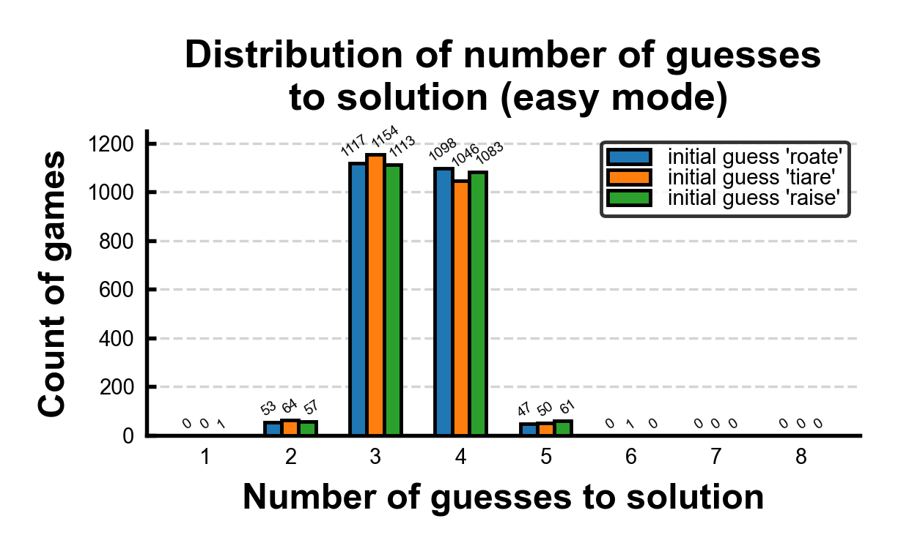
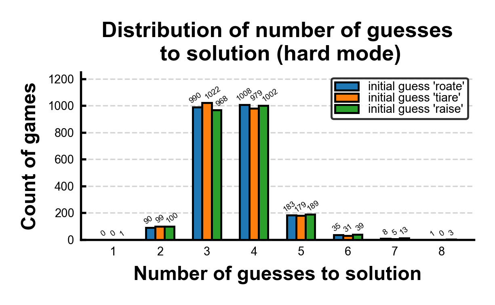
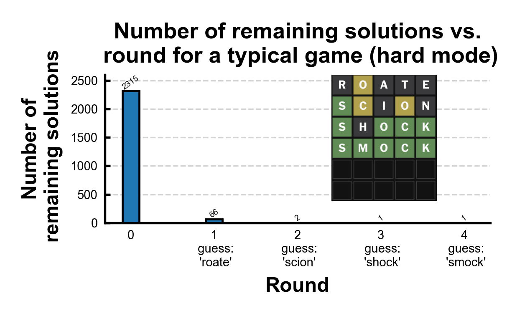

# Wordle-GPU

Wordle-GPU is an elimination-based command-line solver for the game
[Wordle](https://www.nytimes.com/games/wordle/index.html), written in C++ and
HIP to run on AMD GPU.

Demo (left: solver, right: a Wordle GUI): 

## Requirements

- [CMake](https://gitlab.kitware.com/cmake/cmake) >= 3.21
- [ROCm](https://github.com/ROCm/ROCm) >= 5.0
- AMD GPU to run the program (current repo is configured for Radeon Pro VII / gfx906)

## Building the code

Clone the repository, configure using CMake, and build the code:

```bash
git clone https://github.com/mrowan137/wordle-gpu.git
cd wordle-gpu
mkdir build && cd build
cmake ..
make -j
```

## Usage

```bash
./wordle-gpu.exe ../src/guesses.txt ../src/solutions.txt [--hard]
```

The argument `--hard` is an optional positional argument setting the Wordle
difficulty: 'hard mode' enforces that guesses must incorporate the clues; the
default is 'easy' mode, where any guess from [`guesses.txt`](./src/guesses.txt)
is allowed.

After startup, the solver proceeds in rounds, prompting for a 'clue' which is
input in a 10-character format, where the first 5 denote 'colors' and last 5
denote 'letters' of the clue. For the 0th round, the accepted guess is
`??????????`, which indicates to the solver to compute the best guess without
any clue information. For subsequent rounds, the valid clue format is:

- `x` for gray, indicating the guess letter does not appear in the solution.
- `y` for yellow, indicating the guess letter appears in the solution but not at
  that position
- `g` for green, indicating the guess letter appears in the solution with
  correct position

Example:

- Guess = `debug`, solution = `beans` → clue = `xgyxxdebug`
- Second letter is correct with correct position, third letter is correct with
  an incorrect position, and the other letters are incorrect

The program can be exited by inputting `q` at the prompt.

## Algorithm

Wordle-GPU considers all triplets (guess, test, solution) to calculate, for each
valid guess word, the average number of solution eliminations; 'test' denotes a
trial solution from the remaining solution words. Given 'guess' and 'solution,'
the corresponding clue is determined, and the tally of eliminated words for
'guess' is incremented if the clue eliminates 'test.' In this way, a tally of
words eliminated by 'guess' is computed, for all valid combinations of 'test' &
'solution.' The 'best' guess is defined as the one that eliminates the most
words (averaged over all remaining 'solution' words). In case of a tie, a word
from the remaining solutions is preferred, since it could be the solution.

## 10 best initial guesses

By simulating a game with each possible solution, the average number of guesses
to solution, as well as percentage of winnable games, is computed for a
selection of 'best' initial guesses, i.e. the top 10 in terms of initial-round
eliminations. Defining 'best' as most solution eliminations is but one choice of
objective function; it is interesting to note that 'tiare,' while having lesser
1<sup>st</sup>-round average number of eliminated solutions than 'roate,'
results in a lower average number of guesses to solution, and, in hard mode, a
higher percentage of winnable games.

<table>
  <tr>
    <th rowspan="2"> Rank </th>
    <th rowspan="2"> Initial guess </th>
    <th rowspan="2"> 1<sup>st</sup>-round avg. number of eliminated solution words </th>
    <th colspan="2"> Avg. number of guesses to solution </th>
    <th colspan="2"> % winnable games </th>
    <th rowspan="2"> Appears in <a href="./src/solutions.txt">solutions.txt</a>? </th>
  </tr>
  <tr>
    <th> Easy mode </th>
    <th> Hard mode </th>
    <th> Easy mode </th>
    <th> Hard mode </th>
  </tr>
  <tr>
    <td> 1 </td>
    <td> roate </td>
    <td> 2254.58/2315 (97.3901%) </td>
    <td> 3.49201 </td>
    <td> 3.61598 </td>
    <td> 100% </td>
    <td> 99.6112% </td>
    <td> No </td>
  </tr>
  <tr>
    <td> 2 </td>
    <td> tiare </td>
    <td> 2254.07/2315 (97.3680%) </td>
    <td> 3.46868 </td>
    <td> 3.58359 </td>
    <td> 100% </td>
    <td> 99.7840% </td>
    <td> No </td>
  </tr>
  <tr>
    <td> 3 </td>
    <td> raise </td>
    <td> 2254.00/2315 (97.3650%) </td>
    <td> 3.49503 </td>
    <td> 3.63153 </td>
    <td> 100% </td>
    <td> 99.3089% </td>
    <td> Yes </td>
  </tr>
  <tr>
    <td> 4 </td>
    <td> raile </td>
    <td> 2253.67/2315 (97.3508%) </td>
    <td> 3.48510 </td>
    <td> 3.61253 </td>
    <td> 100% </td>
    <td> 99.6112% </td>
    <td> No </td>
  </tr>
  <tr>
    <td> 5 </td>
    <td> soare </td>
    <td> 2252.70/2315 (97.3089%) </td>
    <td> 3.48510 </td>
    <td> 3.63110 </td>
    <td> 100% </td>
    <td> 99.4384% </td>
    <td> No </td>
  </tr>
  <tr>
    <td> 6 </td>
    <td> arise </td>
    <td> 2251.27/2315 (97.2471%) </td>
    <td> 3.51404 </td>
    <td> 3.64104 </td>
    <td> 100% </td>
    <td> 99.3089% </td>
    <td> Yes </td>
  </tr>
  <tr>
    <td> 7 </td>
    <td> irate </td>
    <td> 2251.22/2315 (97.2449%) </td>
    <td> 3.49806 </td>
    <td> 3.61598 </td>
    <td> 100% </td>
    <td> 99.5248% </td>
    <td> Yes </td>
  </tr>
  <tr>
    <td> 8 </td>
    <td> orate </td>
    <td> 2251.11/2315 (97.2402%) </td>
    <td> 3.50022 </td>
    <td> 3.61555 </td>
    <td> 100% </td>
    <td> 99.5680% </td>
    <td> No </td>
  </tr>
  <tr>
    <td> 9 </td>
    <td> ariel </td>
    <td> 2249.71/2315 (97.1797%) </td>
    <td> 3.50022 </td>
    <td> 3.61253 </td>
    <td> 100% </td>
    <td> 99.6544% </td>
    <td> No </td>
  </tr>
  <tr>
    <td> 10 </td>
    <td> arose </td>
    <td> 2248.98/2315 (97.1482%) </td>
    <td> 3.49806 </td>
    <td> 3.61987 </td>
    <td> 100% </td>
    <td> 99.5248% </td>
    <td> Yes </td>
  </tr>
</table>

## 10 worst initial guesses

Even with the 'worst' initial guesses (eliminating the fewest number of solution
words, on average), it's possible to win 100% of games on easy mode, and more
than 99% of games on hard mode. This is not surprising given that the 'best'
guesses have an average number of guesses to solution of around 3.5–3.6; even a
'worst' guess eliminates some words, and so must be better than skipping a turn;
indeed, the 'worst' initial guesses' average number of guesses to solution is
less than 4.6.

<table>
  <tr>
    <th rowspan="2"> Rank </th>
    <th rowspan="2"> Initial guess </th>
    <th rowspan="2"> 1<sup>st</sup>-round avg. number of eliminated solution words </th>
    <th colspan="2"> Avg. number of guesses to solution </th>
    <th colspan="2"> % winnable games </th>
    <th rowspan="2"> Appears in <a href="./src/solutions.txt">solutions.txt</a>? </th>
  </tr>
  <tr>
    <th> Easy mode </th>
    <th> Hard mode </th>
    <th> Easy mode </th>
    <th> Hard mode </th>
  </tr>
  <tr>
    <td> 1 </td>
    <td> xviii </td>
    <td> 1199.88/2315 (51.8307%) </td>
    <td> 4.16803 </td>
    <td> 4.27732 </td>
    <td> 100% </td>
    <td> 99.0929% </td>
    <td> No </td>
  </tr>
  <tr>
    <td> 2 </td>
    <td> zhuzh </td>
    <td> 1264.08/2315 (54.6039%) </td>
    <td> 4.11490 </td>
    <td> 4.24881 </td>
    <td> 100% </td>
    <td> 99.0497% </td>
    <td> No </td>
  </tr>
  <tr>
    <td> 3 </td>
    <td> immix </td>
    <td> 1302.11/2315 (56.2467%) </td>
    <td> 4.12354 </td>
    <td> 4.20907 </td>
    <td> 100% </td>
    <td> 99.3089% </td>
    <td> No </td>
  </tr>
  <tr>
    <td> 4 </td>
    <td> qajaq </td>
    <td> 1341.39/2315 (57.9434%) </td>
    <td> 4.18056 </td>
    <td> 4.31274 </td>
    <td> 100% </td>
    <td> 98.9633% </td>
    <td> No </td>
  </tr>
  <tr>
    <td> 5 </td>
    <td> jujus </td>
    <td> 1405.29/2315 (60.7037%) </td>
    <td> 4.12527 </td>
    <td> 4.24104 </td>
    <td> 100% </td>
    <td> 99.0065% </td>
    <td> No </td>
  </tr>
  <tr>
    <td> 6 </td>
    <td> jugum </td>
    <td> 1408.13/2315 (60.8263%) </td>
    <td> 3.98575 </td>
    <td> 4.08035 </td>
    <td> 100% </td>
    <td> 99.4384% </td>
    <td> No </td>
  </tr>
  <tr>
    <td> 7 </td>
    <td> gyppy </td>
    <td> 1419.00/2315 (61.2959%) </td>
    <td> 4.01339 </td>
    <td> 4.13175 </td>
    <td> 100% </td>
    <td> 99.4816% </td>
    <td> No </td>
  </tr>
  <tr>
    <td> 8 </td>
    <td> yukky </td>
    <td> 1425.08/2315 (61.5585%) </td>
    <td> 4.06782 </td>
    <td> 4.21123 </td>
    <td> 100% </td>
    <td> 99.0497% </td>
    <td> No </td>
  </tr>
  <tr>
    <td> 9 </td>
    <td> xylyl </td>
    <td> 1426.87/2315 (61.6359%) </td>
    <td> 4.10022 </td>
    <td> 4.23499 </td>
    <td> 100% </td>
    <td> 99.2225% </td>
    <td> No </td>
  </tr>
  <tr>
    <td> 10 </td>
    <td> fuffy </td>
    <td> 1431.90/2315 (61.8531%) </td>
    <td> 4.03672 </td>
    <td> 4.17106 </td>
    <td> 100% </td>
    <td> 99.2657% </td>
    <td> No </td>
  </tr>
</table>

## Distribution of number of guesses to solution, easy mode

For the starting guesses 'roate' (greatest average number of
1<sup>st</sup>-round solution eliminations out of any guess), 'tiare' (least
average number of guesses to solution), and 'raise' (highest number of solution
eliminations out of any solution word), we compute the number of guesses to
solution, for each of the 2315 possible solutions. On average, the number of
guesses to solution for starting word 'roate' is 3.492, for 'tiare' is 3.469,
and for 'raise' is 3.495. Though the game length is marginally higher with
'raise,' it has a 1/2315 chance of being the solution, whereas 'roate' and
'tiare' are not in the solutions list and so both have a 0/2315 chance of being
the solution. With all of these starting words, it is possible to win within 6
tries 100% of the time.


## Distribution of number of guesses to solution, hard mode

For hard mode, the average number of guesses to solution for 'roate' is 3.616,
for 'tiare' is 3.583, and for 'raise' is 3.632. In hard mode, it's possible
using the solver to still get 6+ guesses to solution, e.g. for the initial guess
'roate' and solution 'batch,' the solver computes the sequence 'roate, haunt,
watch, patch, match, latch, catch, batch.' Still, 99.61% of the time it is
possible to win within 6 tries using 'roate' as the starting guess, 99.78% using
'tiare', or 99.31% using 'raise.'


## Typical game, hard mode

This is a typical hard-mode game, showing how the number of remaining solutions
decreases with each guess, each of which is calculated according to the provided
definition of 'best' (eliminates the greatest number of remaining solutions).


## Author

Michael E. Rowan – [mrowan137](https://github.com/mrowan137).

## License

This project is licensed under the MIT License – see [LICENSE](./LICENSE) file
for details.

## Copyright

© 2024 Michael E. Rowan.

## Acknowledgments

- Yy Wang: code-scrambler & co-conspirator
- Josh Wardle: original developer of Wordle
- [String formatting function](https://stackoverflow.com/questions/2342162/stdstring-formatting-like-sprintf)
  from Stack Overflow
- [Wordle guesses and solutions](https://gist.github.com/cfreshman/dec102adb5e60a8299857cbf78f6cf57)
  from cfreshman's Gist
